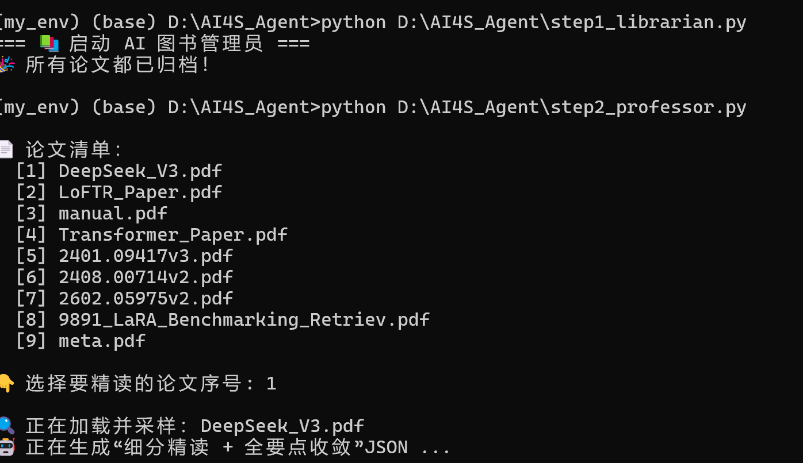
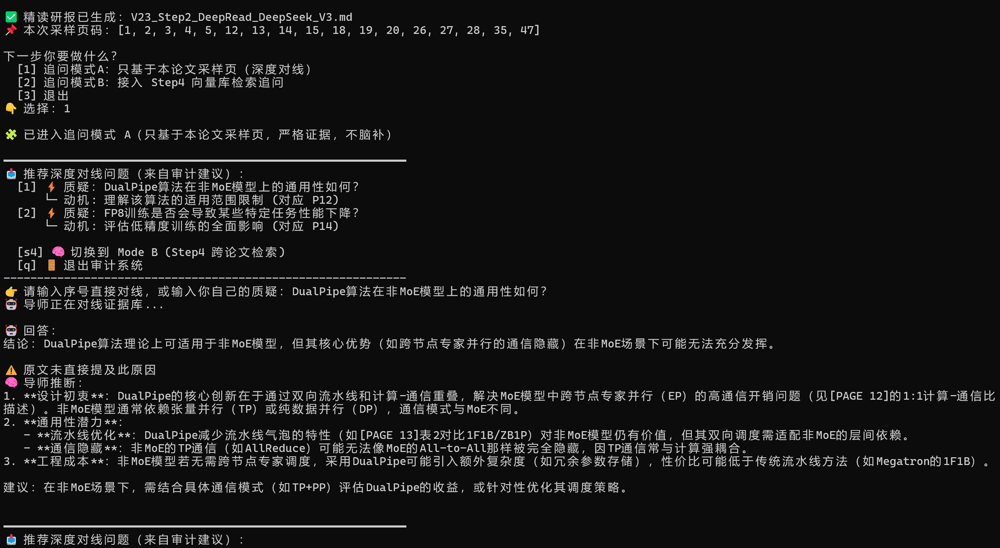
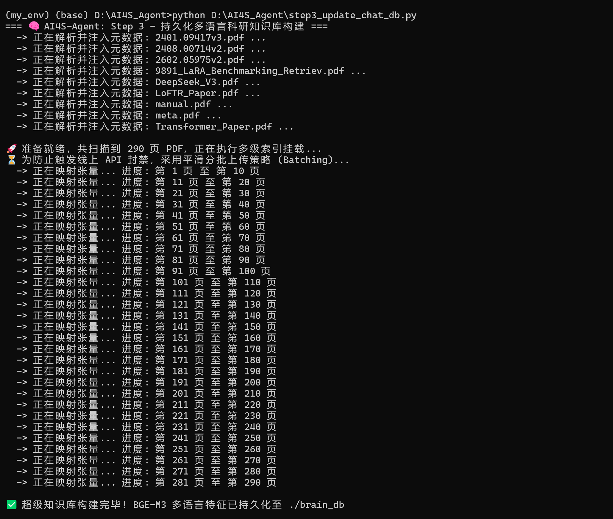
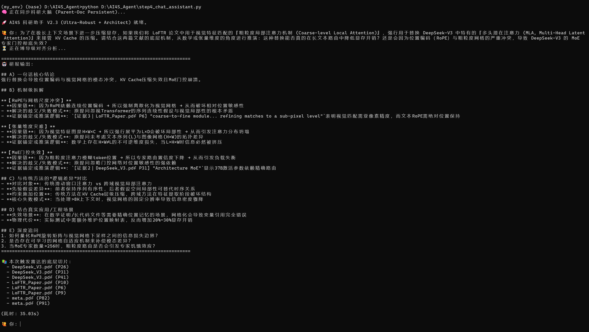
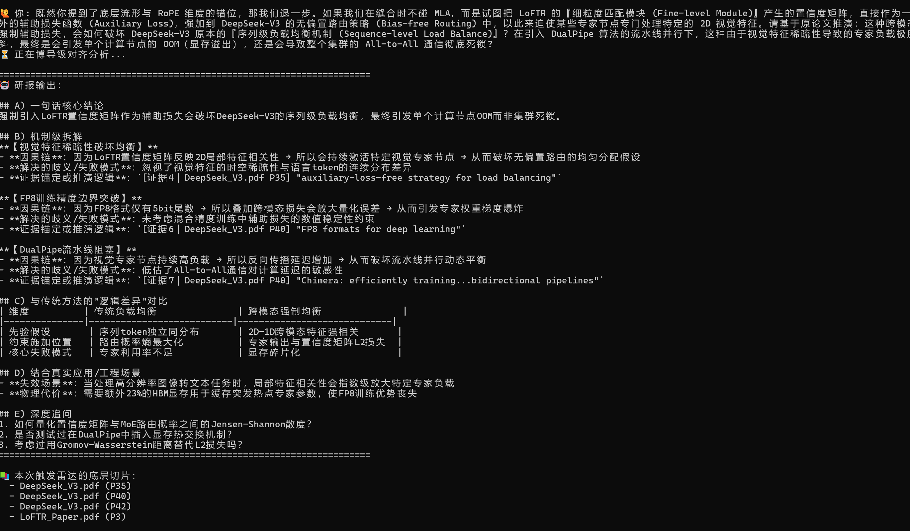

# SciArchitect-智能体：双轨制学术文献智能体
## 1. 项目概述 (Project Overview)

**SciArchitect-Agent** 是一个基于 **LangChain** 框架构建的本地化科研文献检索与推理系统，专为处理高密度、逻辑严谨的**学术 PDF 论文**而设计。旨在解决传统大模型在处理长篇学术文献时易产生的上下文碎片化和推理偏差问题，提升学术文献的阅读和分析效率。

### 核心架构设计：双引擎架构

**检索引擎** (Embedding)：利用 **BAAI/bge-m3** 模型，实现跨语言文献检索，解决不同语言之间的语义不对称问题。

**推理引擎** (LLM)：接入 **DeepSeek-V3.2** 模型，专注于底层数学推理和机制分析，增强推理的精确性，避免不必要的假设和推理错误。

## 2. 如何运行 (How to Run)
### 2.1 系统要求 (System Requirements)

操作系统：**Linux / macOS / Windows**（我是以windows来做的）

Python 版本：**Python 3.7** 或更高版本

硬件要求：推荐使用至少 **8GB RAM** 和 1个 GPU（如 NVIDIA 进行计算加速）来提高处理速度和性能。


### 2.2 环境配置 (Environment Setup)

克隆项目仓库：

进入你希望存放该项目的文件夹，在命令行中执行以下命令来克隆仓库：

```bash
git clone https://github.com/your-username/SciArchitect-Agent.git
cd SciArchitect-Agent
```


安装 Python 依赖：

确保你已经安装了 Python 3.7+，并且安装了 pip 包管理工具。如果没有安装，可以参考 Python 官方网站
 进行安装。

接下来，你需要安装项目所需的所有依赖包。在项目根目录下执行以下命令：

`pip install -r requirements.txt`

requirements.txt 文件中列出了所有必要的 Python 库，确保在安装时下载并安装这些库。


### 2.3 环境变量配置 (Environment Variables Setup)

为了让系统顺利运行，你需要提供 API 密钥。在项目根目录下创建一个 .env 文件，并填入你的 API 密钥：

在项目根目录创建 **.env** 文件（如果没有的话），并填入：

`SILICONFLOW_API_KEY=sk-你的API密钥`

请确保 API 密钥是有效的。如果你没有密钥，可能需要注册并获取一个。

这个 API 密钥将用于访问 硅基流动 (SiliconFlow) API。(我用的是硅基流动的deepseekv3.2模型)

确保 **.env** 文件被列在 **.gitignore** 文件中，以免将敏感信息上传到 GitHub。


### 2.4 依赖包安装 (Install Dependencies)

项目依赖了多个 Python 库，请确保所有依赖都已安装。你可以通过以下命令来安装它们：

`pip install langchain langchain-chroma langchain-openai pypdf python-dotenv`

这些依赖包括：

LangChain：用于实现文献检索和推理。

Chroma：用于存储和检索文献向量数据。

OpenAI：用于调用 OpenAI 的 GPT 模型。

PyPDF：用于从 PDF 中提取文本。

python-dotenv：用于加载 .env 文件中的环境变量。


### 2.5 文献准备 (Preparing the Papers)

将你需要分析的 PDF 文献 文件放置在项目根目录下。这些文献将被自动扫描并用于后续的处理和分析。


### 2.6 运行流程 (Execution Pipeline)

系统分为多个阶段，每个阶段负责不同的任务。请按照以下顺序执行每个阶段：


## Step 1: 图书管理员 (Librarian) - 扫描与清洗
`python step1_librarian.py`

功能：扫描项目根目录下的 PDF 文件，提取文本内容并生成初步的元数据。

输出：生成 **library.json** 文件，其中包含每篇论文的元数据。

运行效果截图：


## ⚙️ **Step 2: 单篇文献精读与审计助手** 

`python step2_professor.py`

在把所有文献全部丢进向量库之前，Step 2 提供了一个高交互性的“单篇论文精读”环境。它的核心目的是带你把单篇核心文献吃透，并利用严格的工程手段压制大模型的幻觉。

主要交互与功能实现
文献选取与智能采样

运行后，系统会列出 Step 1 扫出来的所有本地论文清单供你点播。

选中目标论文（如 DeepSeek_V3.pdf）后，系统不会盲目吞噬全文，而是自动抽取关键页码（如核心机制页、实验数据页等）进行采样。

处理完成后，会在本地自动生成一份该论文专属的 Markdown 精读研报。

### **自带“审稿人”视角的推荐提问**

系统会根据采样内容，自动提取出论文的潜在弱点或核心讨论点，生成“审计建议”。

比如，它会自动建议你提问“DualPipe算法在非MoE模型上的通用性如何？”，并标明这个质疑是由原论文的哪一页（如对应 P12）引发的。

### **受控的双模式追问系统**

**模式 A（深度对线，严格证据）**：强制大模型只基于当前采样的那几页 PDF 回答问题。系统做了一个非常实用的防幻觉设计：如果原文没写，它会明确警告“⚠️原文未直接提及此原因”。随后给出的“推断”内容，也会强制附带具体的页码来源（如 [PAGE 12]、[PAGE 13]）。

**模式 B（跨文检索）**：如果单篇论文的信息不够，支持无缝切换到 Step 4 的向量库模式，进行跨论文的全局追问。

运行效果截图：
## 智能采样选单


## 深度对线演示



## Step 3: **向量化切片与本地知识库构建** 

`step3_update_chat_db.py`

如果说前两步是在整理书架，那 Step 3 就是把书彻底“嚼碎”并装进系统的长期记忆里。这是整个 RAG 架构中最耗时、但也最核心的底层数据处理模块，负责把纯文本转化为大模型能看懂的高维向量，并存入本地数据库。

## 主要技术实现

### 父子文档切分策略 (Parent-Document Chunking)

这是为了解决学术长文本“切碎了丢逻辑，不切搜不到”的经典痛点。

底层逻辑：代码里配置了两套切分尺度。搜索时，系统用细粒度的“子切片”（如 300 Tokens）去精准匹配用户的问题，以保证查准率；但在命中后，系统会向上回溯，把完整的“父切片”（如 1500 Tokens）提出来喂给大模型。这样既保证了检索的精度，又保全了复杂的数学公式和长下文的逻辑连贯性。

### BGE-M3 跨语言映射

放弃了传统的本地小模型，直接通过 SiliconFlow API 调用 BAAI/bge-m3 模型进行 Embedding。它完美支持跨语言检索，能实现“用中文提问，精准命中全英文顶会 PDF 底层机制”，有效避免了语义断层。

### API 并发防爆破机制 (Anti-Rate-Limit Batching)

处理学术文献时，极易因一次性塞入几十万 Token 触发 API 的 429 (并发超限) 或 413 (负载过大) 报错。

工程兜底：脚本在向量化循环中加入了动态分批（Batching）与平滑延时机制。把海量文本切分后，按安全批次排队请求 API，确保几十篇 PDF 的数据能一次性平稳落盘，程序绝不中途崩溃。

### **ChromaDB** 本地持久化落盘

生成的所有向量特征与元数据（Metadata）都会被写入本地物理目录 brain_db 中。只要跑过一次，后续的提问全部基于本地向量库进行秒级检索，不再重复消耗 Embedding 算力。

运行效果截图：
## 向量化构建



## Step 4: 全局检索与深度推理终端
这是整个 AI4S 系统的“大脑”和最终的交互入口。它负责将 Step 3 建好的本地知识库与云端的推理大模型桥接起来，把一个通用的聊天机器人，改造成一个只认文献证据的“赛博学术博导”。

`python step4_chat_assistant.py`

## 主要技术实现
### **LangChain 检索增强链路** (RAG Pipeline)

逻辑：当用户在终端输入硬核学术问题后，系统会先调用 BGE-M3 模型将问题向量化，然后去本地的 brain_db 向量库 中执行高维相似度检索。

实现：提取出最相关的文献切片（包含对应的 Metadata）后，将这些纯净的学术上下文拼接进 Prompt，再一并打包发送给大模型。

### **接入 DeepSeek-V3.2 满血推理机**

逻辑：学术推演不需要大模型有“创造力”，而是需要极强的逻辑链与指令遵循能力。

实现：底层默认挂载了 SiliconFlow 平台上的 Pro/deepseek-ai/DeepSeek-V3.2 模型。通过在代码中将 Temperature（温度值）锁死在极低水平（如 0.1 或 0），剥夺模型的发散性思维，强制它进入冷酷的“物理数学推演模式”。

### **系统级防幻觉与溯源边界 (Anti-Hallucination Boundaries)**

逻辑：防止大模型在找不到答案时强行“脑补”或缝合概念。

实现：通过 System Prompt 施加严苛的规则，强制要求回答必须 100% 锚定在检索到的 PDF 切片上。如果本地库中没有相关技术细节，模型会被要求直接回复“文献中未提及”，从而切断学术幻觉的源头。

### **本地化多轮对话记忆 (Local Memory Management)**

逻辑：学术探讨往往需要连续追问（比如“继续解释上一条中的公式”）。

实现：脚本在本地维护了一个会话缓存文件 assistant_cache.json，用于记录历史问答上下文。这使得大模型能够理解代词和连贯的学术逻辑，而不需要你每次提问都重复背景。

运行效果截图：
## 深度对线演示


## 全局追问演示



## Step 5: 研报生成 (Review Writer) - 自动生成文献综述报告 (可选)
`python step5_review_writer.py`

功能：根据 Step 4 中的问答结果，生成全局主题维度的文献综述报告。

输出：生成一份包含关键论点、实验对比数据与结论的 Markdown 格式报告。

运行效果截图：


## 4. 注意事项与安全规范 (Precautions)

API 密钥管理：请务必使用 .env 文件管理 API 密钥，避免将密钥硬编码到代码中。

仓库数据隔离：生成的 **brain_db** 和 **docstore_data** 会占用大量磁盘空间，且包含敏感文献数据，请确保 **.gitignore** 忽略这些文件。

网络与模型选用：本系统依赖于特定的模型（**BAAI/bge-m3**），确保使用正确的模型进行文献分析。


## 5. 项目可开发性与未来演进 (Future Extensibility)

引入 **GraphRAG** (知识图谱检索)

**跨模态文档解析** (Vision-Language Parsing)

**多代理协作** (Multi-Agent System)

**工程化前端部署** (Web GUI)


## 6. 项目许可证 (License)

本项目采用 **MIT License**，你可以自由使用、修改和分发代码，但请保留原始作者的版权声明和许可证。


## 结语

**SciArchitect-Agent** 旨在为学术研究人员提供一个智能、高效的文献分析工具。通过本项目，你可以轻松地从海量文献中提取关键信息，并获得深入的学术分析，助力科研创新。
